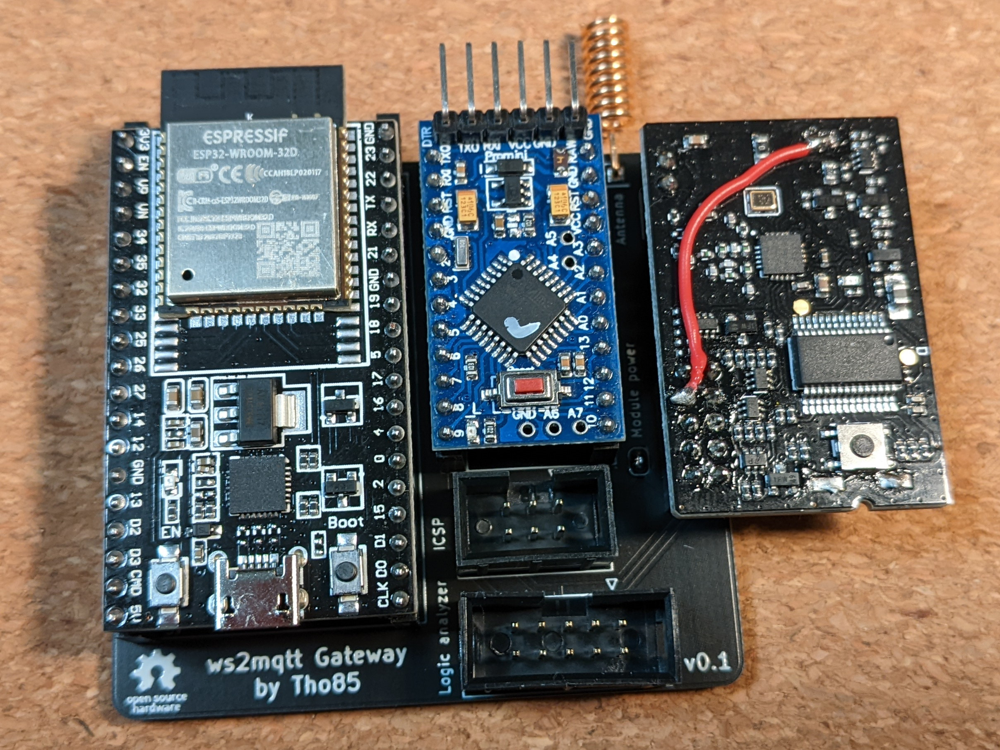
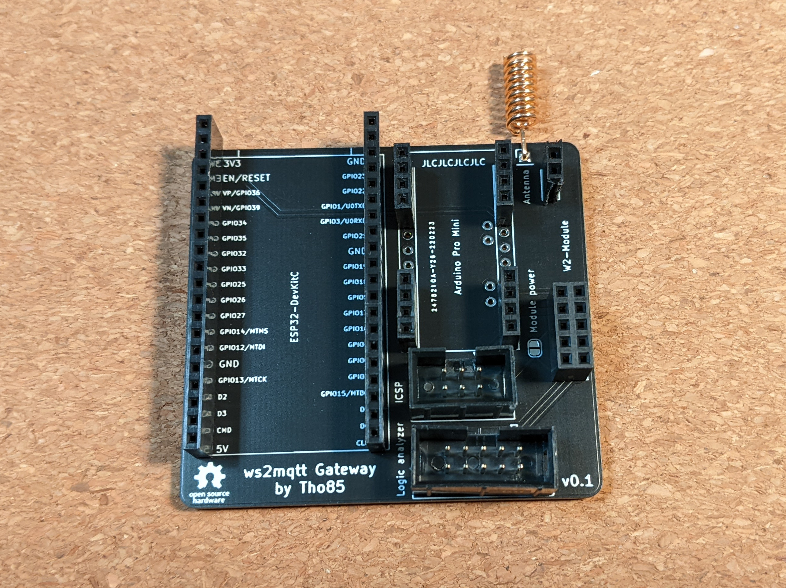
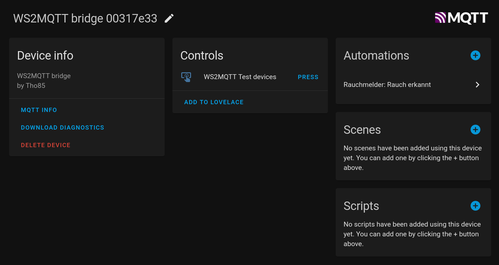
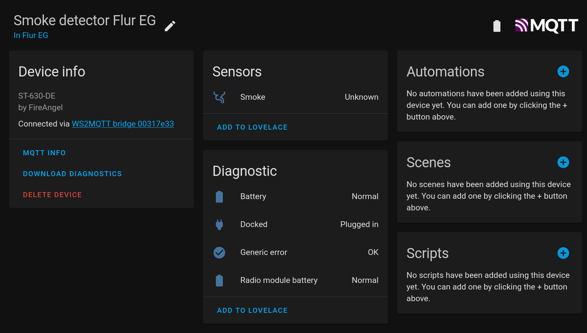

# ws2mqtt - WiSafe2 to MQTT gateway

ws2mqtt is an inofficial gateway to connect WiSafe2 devices to your smart home.

It connects to your existing detector network through a WiSafe2 module. An ESP32 chip communicates with the module through an Arduino SPI/UART converter. The ESP software publishes device states via MQTT and integrates with Home Assistant through MQTT autodiscovery.

## Disclaimer

This project is not related to or endorsed by the manufacturer of WiSafe2 devices. It is an unofficial hobby project.

:warning: **DO NOT USE THIS PROJECT FOR SAFETY-CRITICAL PURPOSES!** :warning:

This is a hobby project after all, so do not rely on it for your personal safety or the saftey of others. Always assume that it will not work in a case of emergency, and plan your emergency procedures accordingly. As the [license](LICENSE.md) states in more detail, I won't be liable for any damages incurred by this project.

## Pictures

## Supported devices

Tested:

- ST-630-DE(P) Smoke detector
- HT-630-EUT Heat detector

Not tested, but should be working:

- WST-630 Smoke alarm
- W2-CO-10X CO alarm
- FP1720W2-R Smoke alarm
- FP2620W2-R Smoke alarm

## Features

- [x] Smoke / heat detector states:
  - [x] Smoke / heat detected
  - [x] Battery state
  - [x] Radio module battery state
  - [x] Device attached to base
- [x] Test button detection
- [x] Combined test button / detection event (see Tips & troubleshooting)
- [x] Test all devices from Home Assistant

TODO:

- [ ] Test single device from Home Assistant
- [ ] Logging via MQTT
- [ ] ESP32 over-the-air updates

## Additional Hardware required

- [ESP32-DevKitC V4](https://docs.espressif.com/projects/esp-idf/en/latest/esp32/hw-reference/esp32/get-started-devkitc.html)
- [Arduino Pro Mini](https://www.arduino.cc/en/pmwiki.php?n=Main/ArduinoBoardProMini), or chinese clone
- [WiSafe2 module](https://www.directtradesupplies.co.uk/product.php/199997/fireangel-wisafe2-module--wireless-alarm-pairing--all-wisafe2--mains---battery-only--alarms-can-be-paired---white-)
- Custom PCB (see `PCB` folder), or alternatively, lots of wires (see [schematic](PCB/schematic.pdf))

## Setup

- Setup Arduino
  - Mount Arduino to PCB
  - Flash Arduino firmware (see `Firmware-Atmega` folder) via programmer
- Setup ESP32
  - Mount ESP32 to PCB
  - Configure your secrets in `Firmware-ESP/include/credentials.h` (see example)
  - Flash ESP32 firmware (see `Firmware-ESP` folder) via USB
- Power board via ESP32 USB connector
- Setup WiSafe2 module
  - Mount WiSafe2 module to PCB
  - Join WiSafe2 network
    - Push button on module for 5 seconds
    - Module LED should light up
    - Within 5 seconds, push test button on a different detector
    - Module LED should blink multiple times as a confirmation
- Mount ESP32, Arduino and WiSafe2 module on PCB
  - Open Home Assistant
  - The gateway and all detectors should be visible in the "Devices" tab

## Tips & troubleshooting

* The recommended way to react to smoke detection and test events in Home Assistant is to listen to the `alarm` event emitted by the `ws2mqtt Bridge` device. This event is fired when any of the connected detectors detects smoke, or when any of the detectors' test buttons is pressed. This way you can test your emergency scenes and automations by pressing a detector's test button.

* _The "smoke detected" sensor shows an unknown state_

  This is actually a deficiency of the WiSafe2 protocol. As far as I know, there is no way to query a device for the current smoke / heat detector state. Additionally, a "smoke detected" message is only sent once to other detectors, and not repeated later. So if you start the gateway while a "smoke detected" event is ongoing, there is no way for the gateway to know about that event. I decided to err on the side of caution and show the state of devices as "unknown".

* _The "battery" sensor, "docked" sensor etc. show an unknown state_

  To conserve battery power, the gateway does not actively query the state of these diagnostic sensors. The sensor state is only updated on change. The easiest way to force an update is to remove a detector from its base, wait a bit, and re-mount the device. This should update not only the "docked" sensor, but also the battery ones.

* What is the programming language you used, and why is it not perfect C?

  C is not my mother tongue, so it's nearly certain that there are race conditions, buffer overflows or bad C programming practices in the code. Feel free to file an issue to point things out, or even better file a pull request.

## License

See [LICENSE](LICENSE.md).
